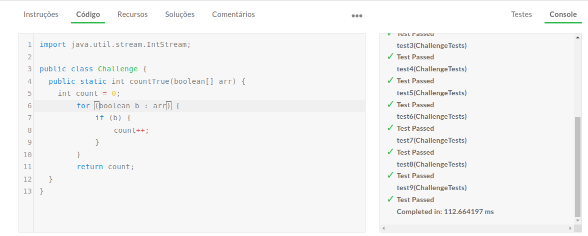

# V_Camp Desafio Edabit

## Participante

Duyllyan Almeida de Carvalho  
https://www.linkedin.com/in/duyllyan/

## Descrição

Repositório criado para resolução do desafio da V_Camp da Valtech.

| Desafio      | How Much is True ?                                                    |
| ------------ | --------------------------------------------------------------------- |
| Linguagem    | Java                                                                  |
| Nível        | Médio                                                                 | 
| Link         | [Clique para acessar](https://edabit.com/challenge/vKpGt4ufSKmEJ3Xjd) |

Crie uma função que retorna o número de valores **'true'** em um array.

## Exemplos

```java
countTrue({true, false, false, true, false}) // return 2

countTrue({false, false, false, false}) // return 0

countTrue({}) //return 0
```
## Notas
* Retorna 0 se o array estiver vazio.
* Todos os itens são do tipo boolean.

## Captura dos Testes


